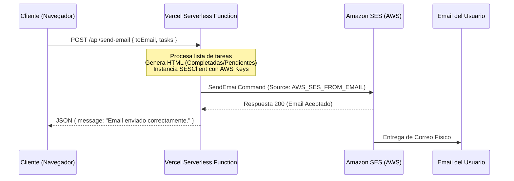

# Task Manager 📝✨

¡Bienvenido a **Task Manager**, una aplicación web moderna, responsiva y de alto rendimiento diseñada para simplificar y optimizar la gestión diaria de tus tareas! 

Esta aplicación combina tecnologías front-end de vanguardia, un backend serverless altamente eficiente y almacenamiento en tiempo real, todo ello envuelto bajo una estética visual premium de tipo **Glassmorphism** y soporte completo para temas claro y oscuro.

---

## 🚀 Enlaces de Producción

* **Repositorio de GitHub:** [https://github.com/joacomgl/task-manager](https://github.com/joacomgl/task-manager)
* **Despliegue en Producción (Vercel):** [https://task-manager-eight-xi-63.vercel.app](https://task-manager-eight-xi-63.vercel.app)

---

## 🎨 Características Destacadas

- **Diseño Glassmorphism Premium:** Interfaz limpia con efectos de vidrio esmerilado, sombras suaves, bordes semitransparentes y tipografía moderna (`Inter`).
- **Modo Oscuro/Claro Dinámico:** Selector de tema instantáneo mediante un botón de alternancia, gestionado a través de variables CSS nativas y un hook de React persistente.
- **Autenticación Completa:** Inicio de sesión y registro de usuarios mediante Firebase Authentication, incluyendo soporte para credenciales locales (email/contraseña) e inicio de sesión social rápido con **Google**.
- **Gestión de Tareas en Tiempo Real:** CRUD completo de tareas con sincronización en tiempo real mediante Firestore (actualizaciones sin necesidad de recargar la página).
- **Edición Inline de Tareas:** Cada tarea cuenta con un botón "Editar" que activa un formulario inline para modificar título y descripción sin salir de la vista, con botones de Guardar y Cancelar.
- **Filtros Inteligentes:** Clasificación de tareas en "Todas", "Pendientes" y "Completadas" mediante una barra de filtros conectada a la función utilitaria `filterTasks`.
- **Resumen por Correo Electrónico:** Un flujo backend serverless integrado con Amazon SES para enviar resúmenes HTML con el estado de tus tareas directamente a tu correo con un solo clic.

---

## 🛠️ Decisiones Arquitectónicas

Para este proyecto, se ha adoptado una arquitectura basada en el desacoplamiento de servicios y el uso de tecnologías serverless para garantizar la escalabilidad, la velocidad de carga y costes mínimos de infraestructura:

1. **Vite + React 19 + TypeScript (Frontend):**
   - **Vite** ofrece un entorno de desarrollo ultrarrápido con Hot Module Replacement (HMR).
   - **React 19** asegura un renderizado eficiente y declarativo.
   - **TypeScript** proporciona tipado estático fuerte en todo el codebase, minimizando errores en tiempo de ejecución.

2. **Vanilla CSS (Diseño y Temas):**
   - En lugar de añadir la sobrecarga de frameworks utilitarios como TailwindCSS, se diseñó un sistema de estilos CSS modular y optimizado.
   - El uso de variables CSS (`--bg-color`, `--glass-bg`, etc.) facilita la transición fluida del tema de diseño y los efectos de vidrio (glassmorphism) con un rendimiento de renderizado inmejorable.

3. **Firebase (Base de Datos y Autenticación):**
   - **Firestore:** Se configuró un flujo reactivo usando el listener `onSnapshot` en lugar de peticiones HTTP tradicionales. Esto permite que cualquier cambio en las tareas de la base de datos se refleje instantáneamente en la interfaz de usuario en cualquier pestaña o dispositivo.
   - **Firebase Auth:** Delegar la autenticación de usuarios garantiza la máxima seguridad de las credenciales sin tener que implementar un flujo complejo de hash de contraseñas, tokens JWT o almacenamiento local seguro.

4. **Vercel Serverless Functions + Amazon SES (Backend & Notificaciones):**
   - Para no levantar un servidor Node.js independiente (Express) solo para tareas de backend protegidas, se implementó una función serverless en la ruta `/api/send-email.ts`.
   - Vercel escala automáticamente esta función y solo cobra por el tiempo de cómputo exacto consumido.
   - La función interactúa de forma segura con el SDK de AWS SES (`@aws-sdk/client-ses`) utilizando credenciales de AWS almacenadas en las variables de entorno privadas del servidor.

5. **Vitest + React Testing Library (Pruebas):**
   - Vitest proporciona una ejecución de tests sumamente veloz debido a su integración nativa con el motor de Vite.
   - Se configuraron mocks avanzados para simular completamente el comportamiento de Firebase, permitiendo que la suite de pruebas verifique componentes y lógica de manera 100% offline, confiable y repetible.

---

## ⚙️ Configuración e Instalación Local

### Requisitos Previos
Asegúrate de tener instalado [Node.js](https://nodejs.org/) (versión 18 o superior) y npm en tu máquina.

### Pasos para Configurar el Entorno:

1. **Clonar el repositorio:**
   ```bash
   git clone https://github.com/joacomgl/task-manager.git
   cd task-manager
   ```

2. **Instalar dependencias:**
   ```bash
   npm install
   ```

3. **Configurar Variables de Entorno (`.env`):**
   Copia el archivo de plantilla `.env.example` y renómbralo a `.env`:
   ```bash
   cp .env.example .env
   ```
   Abre el archivo `.env` en tu editor y completa los valores correspondientes:

   ```env
   # Credenciales de Firebase (Frontend)
   VITE_FIREBASE_API_KEY=tu_firebase_api_key
   VITE_FIREBASE_AUTH_DOMAIN=tu_proyecto.firebaseapp.com
   VITE_FIREBASE_PROJECT_ID=tu_proyecto_id
   VITE_FIREBASE_STORAGE_BUCKET=tu_proyecto.firebasestorage.app
   VITE_FIREBASE_MESSAGING_SENDER_ID=tu_messaging_sender_id
   VITE_FIREBASE_APP_ID=tu_firebase_app_id

   # Credenciales de AWS & SES (Backend Serverless)
   AWS_ACCESS_KEY_ID=tu_aws_access_key_id
   AWS_SECRET_ACCESS_KEY=tu_aws_secret_access_key
   AWS_REGION=us-east-2
   AWS_SES_FROM_EMAIL=tu_email_verificado_en_ses@gmail.com
   ```

   > [!IMPORTANT]
   > Las variables que comienzan con `VITE_` son expuestas al frontend por Vite. Las variables `AWS_` permanecen ocultas y seguras en el backend del servidor y nunca se exponen al cliente.

4. **Correr en modo de desarrollo:**
   ```bash
   npm run dev
   ```
   La aplicación estará disponible en [http://localhost:5173](http://localhost:5173).

---

## 🧪 Cómo Ejecutar los Tests

La suite de pruebas utiliza **Vitest** y **React Testing Library** para asegurar el correcto funcionamiento de los componentes y las utilidades. Las pruebas de Firebase están completamente aisladas mediante mocks para evitar efectos secundarios en la base de datos de producción.

Para ejecutar los tests de una sola vez:
```bash
npm run test
```

Para ejecutar los tests en modo interactivo/observador (watch mode) durante el desarrollo:
```bash
npm run test:watch
```

La estructura de tests cubre:
- **`App.test.tsx`:** Verifica el renderizado de la página principal de tareas con sus respectivos mocks de autenticación.
- **`TodoForm.test.tsx`:** Comprueba la inserción de nuevas tareas y validaciones del formulario.
- **`TodoList.test.tsx`:** Verifica el listado, la alternancia de completado, la eliminación y la edición inline de tareas.
- **`helpers.test.ts`:** Valida la lógica pura de la función `filterTasks` (casos: todas, pendientes y completadas), que además está integrada directamente en la barra de filtros de la UI (`Tasks.tsx`).

---

## 📬 Flujo de Envío de Emails (Integración con Amazon SES)

El envío del resumen de tareas por email sigue un flujo estructurado y seguro:



### ¿Cómo Funciona la Integración?

1. **Petición del Cliente:** El botón "📧 Enviar resumen por email" en la vista de tareas recopila el correo del usuario actualmente autenticado y la lista completa de tareas. Realiza un `POST` HTTP al endpoint local `/api/send-email`.
2. **Generación del Contenido:** La función serverless en [send-email.ts](file:///c:/Users/zavir/Desktop/Henry/M4/PI/task-manager/api/send-email.ts) recibe los datos, filtra las tareas en dos grupos (completadas y pendientes) y construye dinámicamente un cuerpo HTML estructurado con listas de viñetas y emojis ilustrativos.
3. **Autenticación con AWS:** Utilizando las credenciales seguras del entorno (`AWS_ACCESS_KEY_ID` y `AWS_SECRET_ACCESS_KEY`), el servidor crea un cliente de AWS SES e invoca un comando `SendEmailCommand`.
4. **Envío y Seguridad:** 
   - El correo remitente se toma de `AWS_SES_FROM_EMAIL`.
   - **Nota sobre el Sandbox de AWS SES:** Al crear una cuenta en AWS, el servicio de correo SES se inicializa en modo "Sandbox" por motivos de seguridad contra spam. En este modo, **tanto el email del remitente como el del destinatario deben estar verificados** individualmente en la consola de AWS SES para que el correo se entregue correctamente.

---

## ☁️ Cómo Desplegar en Vercel

Desplegar el proyecto en Vercel es muy rápido y se puede realizar de forma gratuita:

### Paso 1: Subir el proyecto a GitHub
Asegúrate de que tus últimos cambios estén confirmados y subidos a tu repositorio de GitHub.

### Paso 2: Importar en Vercel
1. Ve a la plataforma de [Vercel](https://vercel.com/) e inicia sesión con tu cuenta de GitHub.
2. Haz clic en **"Add New"** -> **"Project"**.
3. Importa tu repositorio `task-manager`.

### Paso 3: Configurar Build y Variables de Entorno
1. Vercel detectará de manera automática que es un proyecto de Vite.
2. **Build and Development Settings:**
   - Build Command: `npm run build` (se ejecuta `tsc -b && vite build` para validar tipos antes del build).
   - Output Directory: `dist`.
3. **Environment Variables:**
   Añade una a una todas las variables de entorno de tu archivo `.env` local. Asegúrate de escribir exactamente los mismos nombres de clave:
   - `VITE_FIREBASE_API_KEY`
   - `VITE_FIREBASE_AUTH_DOMAIN`
   - `VITE_FIREBASE_PROJECT_ID`
   - `VITE_FIREBASE_STORAGE_BUCKET`
   - `VITE_FIREBASE_MESSAGING_SENDER_ID`
   - `VITE_FIREBASE_APP_ID`
   - `AWS_ACCESS_KEY_ID`
   - `AWS_SECRET_ACCESS_KEY`
   - `AWS_REGION`
   - `AWS_SES_FROM_EMAIL`

4. Haz clic en **Deploy**. ¡Vercel configurará todo y te entregará tu URL de producción en menos de dos minutos!

### Configuración Adicional (`vercel.json`):
El archivo [vercel.json](file:///c:/Users/zavir/Desktop/Henry/M4/PI/task-manager/vercel.json) contiene la siguiente regla de reescritura:
```json
{
  "rewrites": [
    {
      "source": "/((?!api/).*)",
      "destination": "/index.html"
    }
  ]
}
```
Esto asegura que cualquier ruta secundaria (como `/login`, `/register` o `/tasks`) cargue el archivo `index.html` para que React Router maneje las rutas en el cliente, evitando devolver un error 404 al recargar la página. Las peticiones a `/api/...` se excluyen de esta regla y van directo a las funciones serverless de Vercel.

---

## 🤖 Integración de la Inteligencia Artificial (IA) en el Desarrollo

Este proyecto se ha desarrollado implementando metodologías de **Programación en Pareja impulsada por Inteligencia Artificial (AI Pair Programming)** utilizando el agente avanzado **Antigravity** de Google DeepMind. La IA no solo actuó como un autocompletador de código, sino como un colaborador integral en las distintas capas del ciclo de desarrollo:

1. **Scaffolding e Incepción Arquitectónica:**
   - La IA ayudó a estructurar las carpetas del proyecto en subdirectorios claros (`/components`, `/hooks`, `/pages`, `/services`, `/routes`, `/types`, `/utils`) y estructuró las rutas de React Router 7 usando layouts declarativos y componentes de enrutamiento protegido.

2. **Desarrollo Backend Serverless:**
   - Co-escribió el endpoint serverless `/api/send-email.ts` con tipado explícito para `VercelRequest` y `VercelResponse`.
   - Implementó la configuración óptima del cliente de AWS SES e ideó la generación del cuerpo del correo en HTML, asegurando un diseño ordenado y visualmente legible para el usuario receptor.

3. **Interfaz y Diseño Visual (Glassmorphism & Tematización):**
   - La IA colaboró en la creación de los estilos CSS modernos, sugiriendo paletas de color HSL armoniosas y efectos de desenfoque (`backdrop-filter: blur()`).
   - Diseñó e implementó el hook `useTheme` junto con los cambios en las clases HTML y variables CSS raíz, asegurando que las transiciones de tema fueran dinámicas y libres de parpadeos no deseados.

4. **Estrategia y Aislamiento de Pruebas (QA):**
   - Configuración de Vitest para dar soporte a componentes React con DOM simulado (jsdom).
   - La IA escribió los archivos de pruebas (`App.test.tsx`, `TodoForm.test.tsx`, `TodoList.test.tsx`) y diseñó mocks limpios para las llamadas del SDK de Firebase Auth (`useAuth`) y Firebase Firestore (`useTasks`), lo que permite correr la suite entera de forma offline con total seguridad y rapidez.

5. **Resolución de Errores y Refactorización:**
   - Asistió en la depuración de tipados complejos de TypeScript y resolvió errores comunes de inicialización de dependencias e importación de rutas.
